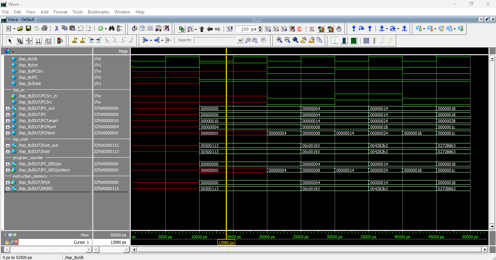
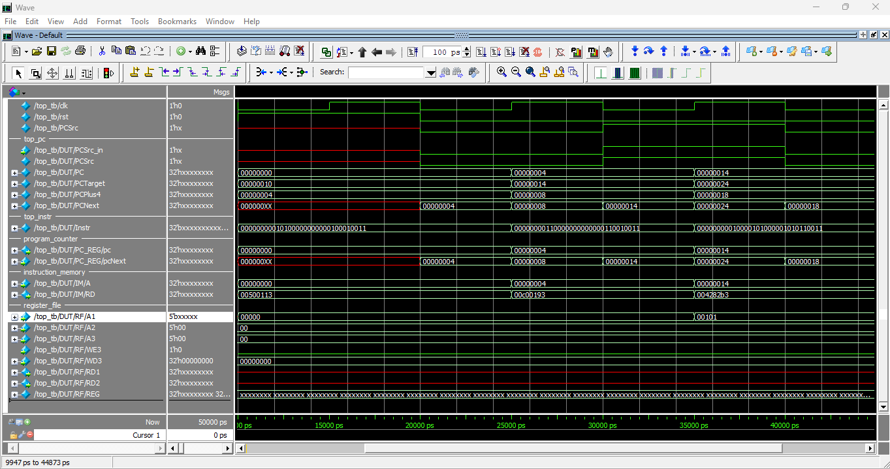

# Single-Cycle RISC-V Processor

## Step 1: Instruction Fetch

The first stage in the single-cycle datapath is the **Instruction Fetch**. During this step, the processor reads the instruction from the instruction memory at the address specified by the Program Counter (PC).

### Modules involved:

- **Program Counter (PC):** Holds the address of the current instruction. It updates on each clock cycle to point to the next instruction address.
- **Instruction Memory:** A read-only memory module that outputs the instruction stored at the address provided by the PC.

### Process overview:

- The PC provides the current instruction address to the instruction memory.
- The instruction memory returns the 32-bit instruction located at that address.
- The PC is then updated to the next address, depending on `PCSrc` to determine if it should proceed to the next sequential instruction or jump to a target address.

### Simulation Waveform

The waveform below shows the behavior of the PC and instruction fetch signals during simulation.

## Step 2: Read source operand (rs1) from RF

The second stage in the single-cycle datapath is the **Register Read**. In this step, the processor reads the first source operand (`rs1`) from the register file, based on the instruction that was just fetched.

### Modules involved:

- **Register File:** Contains 32 general-purpose registers, each 32 bits wide. It supports two simultaneous reads and one write.

### Process overview:

- The instruction bits `[19:15]` specify the address of source register `rs1`.
- This address (`A1`) is fed into the register file.
- The register file outputs the 32-bit value stored at that register (`RD1`), which will later be used by the ALU or memory stages.

### Simulation Waveform

The waveform below shows the values being read from `rs1`, as well as how the address `A1` is derived from the instruction bits.

