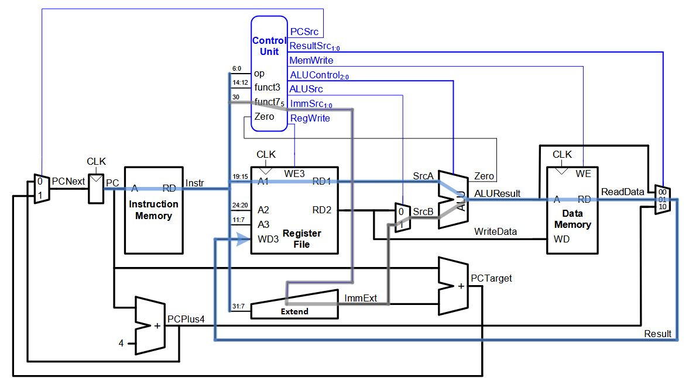

# RISC-V Single Cycle processor in Verilog

**Overview**  
This project implements a simple 32-bit RISC-V Single Cycle processor in Verilog. It includes all major datapath components, a top-level integration (`top.v`), and a testbench (`top_tb.v`) to verify functionality.

---

## Repository Structure

```
├── diagrams/
│   └── r5_single_cycle_datapath.png
│
├── alu.v
├── alu_decoder.v
├── control_unit.v
├── data_memory.v
├── immediate_generator.v
├── instruction_memory.v
├── main_decoder.v
├── pc_plus4.v
├── pc_target.v
├── program_counter.v
├── register_file.v
├── top.v
│
├── alu_decoder_tb.v
├── top_tb.v
│
├── simulation/
│   └── questa/
│       ├── wave_riscv.do
│       ├── step_1_fetch_instruction.do
│       ├── step_2_register_read_rs1.do
│       ├── step_3_register_read_rs2.do
│       ├── step_4_execute_ALU.do
│       └── step_5_mem_to_reg.do
│
├── simulation_waveforms/
│   ├── final_execution.png
│   ├── step1_instruction_fetch.png
│   ├── step2_register_read_rs1.png
│   ├── step3_immediate_b.png
│   ├── step3_immediate_i.png
│   ├── step3_immediate_j.png
│   ├── step3_immediate_s.png
│   ├── step4_alu_decoder.png
│   ├── step4_alu.png
│   ├── step4_console_alu.png
│   ├── step4_console_decoder.png
│   ├── step5_console_output.png
│   ├── step5_memory_writeback.png
│
├── docs/
│   └── architecture_and_modules.md
│
├── README.md
```

---

## Module Descriptions

### `top.v` (Top-Level Integration)  
- **Responsibilities:**  
  - Instantiates and wires up all datapath components.  
  - Implements PC update logic (branch/jump vs. sequential).  
  - Selects write-back source (ALU result, memory read, or `PC+4`).  
- **Key I/O:**  
  - `clk`, `rst`  
  - Exposes only clock/reset; all other logic is internal.

### `program_counter.v`  
- **Purpose:** Holds and updates the current PC value.  
- **Behavior:** On reset, PC ← 0; otherwise on each clock edge PC ← `pcNext`.

### `instruction_memory.v`  
- **Purpose:** Synchronous ROM for instructions.  
- **Initialization:** Loads `instructions.hex`.  
- **Access:** Word-aligned fetch based on high bits of `PC`.

### `control_unit.v`  
- **Purpose:** Top-level control decoder.  
- **Submodules:**  
  - **`main_decoder.v`**: Decodes opcode → main control signals (branch, mem write, ALU src, etc.).  
  - **`alu_decoder.v`**: Decodes `funct3`/`funct7` + ALU-op hint → exact ALU control code.  
- **Output:** Control signals plus `PCSrc` logic for branches/jumps.

### `register_file.v`  
- **Purpose:** 32 × 32-bit register file.  
- **Features:**  
  - Two read ports (`rs1`, `rs2`), one write port (`rd`).  
  - Register-zero is hardwired to zero.  
  - Writes occur on rising clock when `WE3` is high.

### `immediate_generator.v`  
- **Purpose:** Extracts and sign-extends immediates for I, S, B, and J instruction formats.

### `pc_plus4.v` & `pc_target.v`  
- **`pc_plus4.v`**: Computes `PC + 4`.  
- **`pc_target.v`**: Computes branch/jump target `PC + immExt`.

### `ALU.v`  
- **Purpose:** Core arithmetic/logic unit.  
- **Operations:** ADD, SUB, AND, OR, SLT; outputs zero flag for branches.

### `data_memory.v`  
- **Purpose:** 1K-word synchronous memory.  
- **Behavior:**  
  - Combinational read from `Data_mem[A]`.  
  - Synchronous write on clock when `WE` is asserted.

---

## Datapath Diagram



---

For implementation details and project workflow, see [docs/implementation_details.md](docs/implementation_details.md)