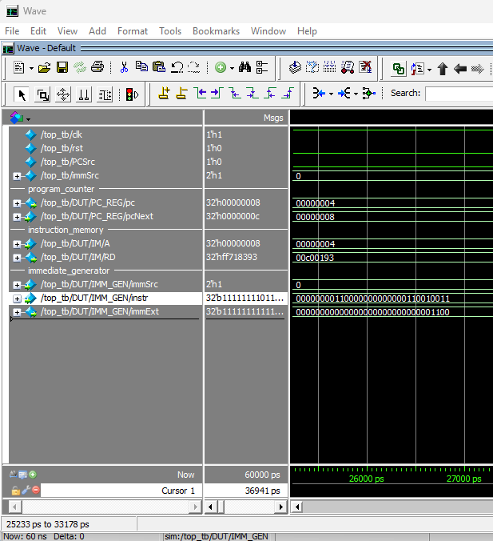
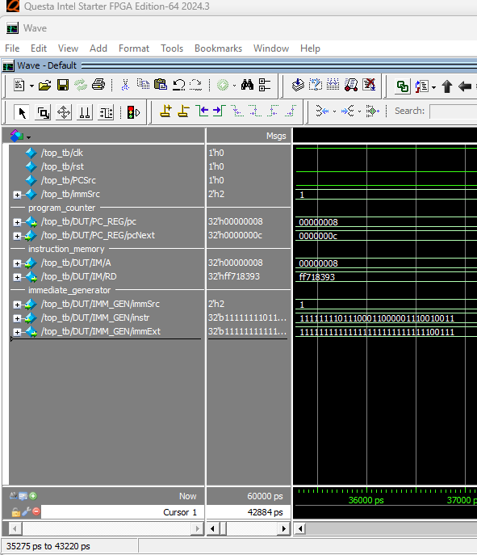
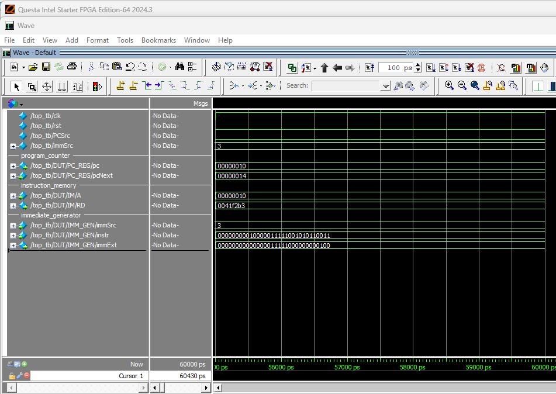
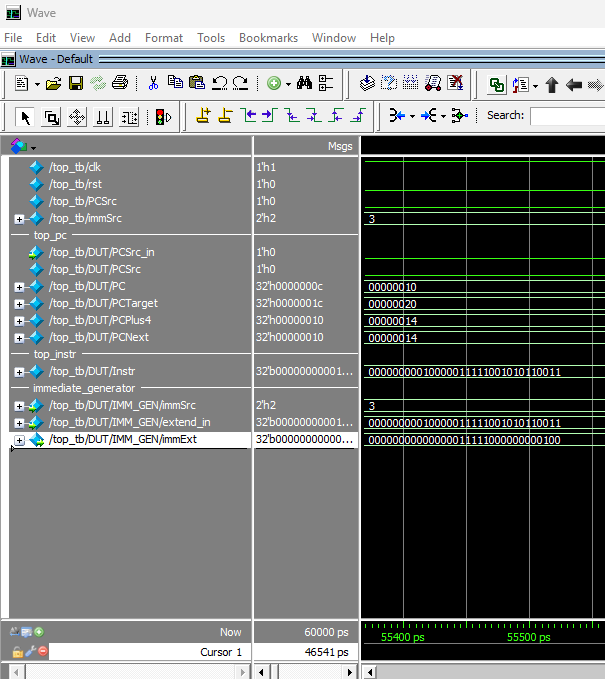
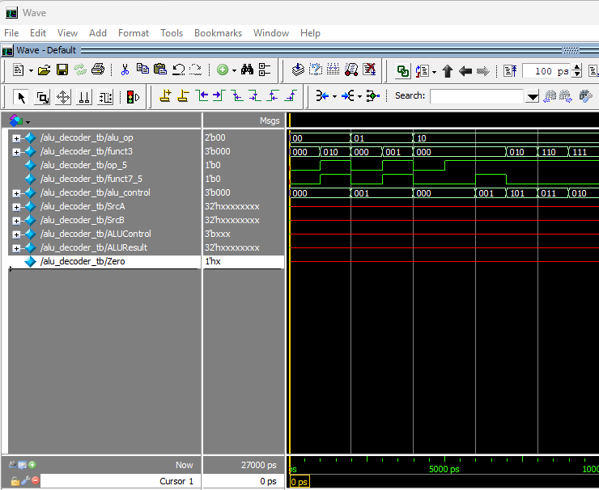
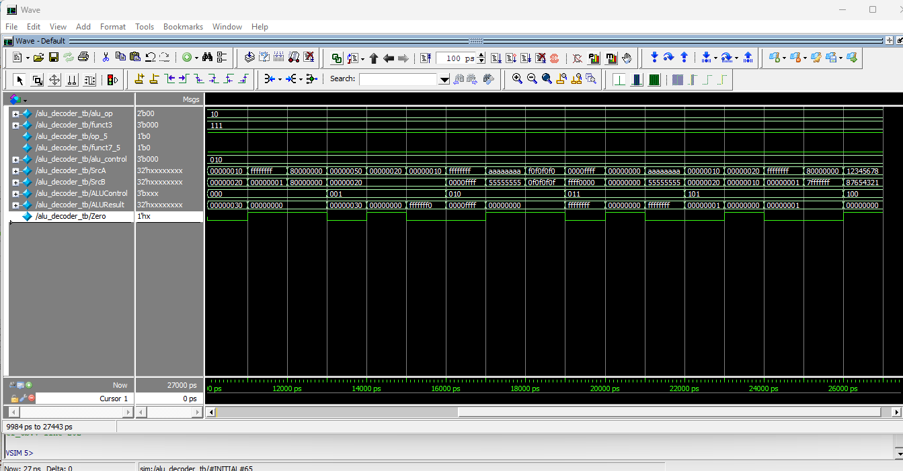
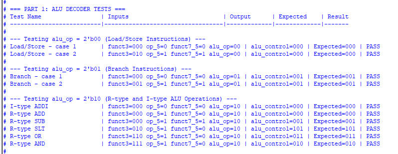
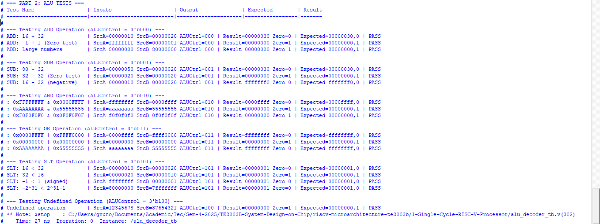
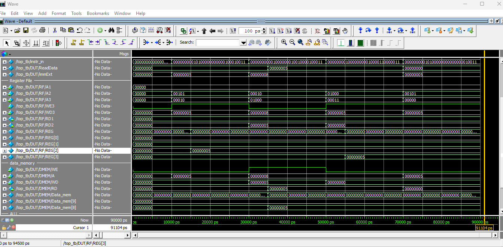
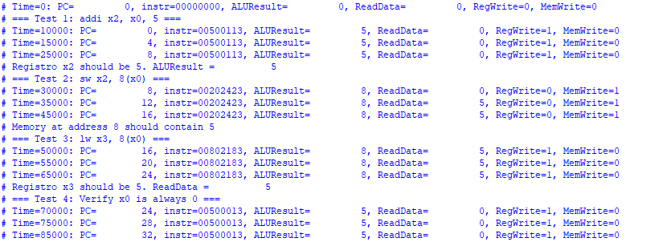

# Single-Cycle RISC-V Processor

## Step 1: Instruction Fetch

The first stage in the single-cycle datapath is the **Instruction Fetch**. During this step, the processor reads the instruction from the instruction memory at the address specified by the Program Counter (PC).

### Modules involved:

- **Program Counter (PC):** Holds the address of the current instruction. It updates on each clock cycle to point to the next instruction address.
- **Instruction Memory:** A read-only memory module that outputs the instruction stored at the address provided by the PC.

### Process overview:

- The PC provides the current instruction address to the instruction memory.
- The instruction memory returns the 32-bit instruction located at that address.
- The PC is then updated to the next address, depending on `PCSrc` to determine if it should proceed to the next sequential instruction or jump to a target address.

### Simulation Waveform

The waveform below shows the behavior of the PC and instruction fetch signals during simulation.


## Step 2: Read source operand (rs1) from RF

The second stage in the single-cycle datapath is the **Register Read**. In this step, the processor reads the first source operand (`rs1`) from the register file, based on the instruction that was just fetched.

### Modules involved:

- **Register File:** Contains 32 general-purpose registers, each 32 bits wide. It supports two simultaneous reads and one write.

### Process overview:

- The instruction bits `[19:15]` specify the address of source register `rs1`.
- This address (`A1`) is fed into the register file.
- The register file outputs the 32-bit value stored at that register (`RD1`), which will later be used by the ALU or memory stages.

### Simulation Waveform

The waveform below shows the values being read from `rs1`, as well as how the address `A1` is derived from the instruction bits.


## Step 3: Immediate Extension

The third stage in the single-cycle datapath is **Immediate Extension**. This step involves extracting and sign-extending the immediate field of the instruction, depending on its format.

### Modules involved:

- **Immediate Generator:** Based on the value of `immSrc`, this module takes the appropriate bits of the instruction and produces a 32-bit sign-extended immediate value.

### Process overview:

- The instruction bits `[31:0]` are passed as `extend_in`.
- The `immSrc` signal determines the instruction type:
  - `00`: I-type
  - `01`: S-type
  - `10`: B-type
  - `11`: J-type
- The immediate generator extracts the immediate fields and sign-extends them to 32 bits.

### Instruction Type Examples

**I-type**  
Instruction: `00000000110000000000000110010011`  
`immSrc = 00`  
Immediate field: 
- `instr[31] = 0`
- `instr[31:20] = 000000001100`  
`immExt = {{20{0}}, 000000001100}`  
➡ `immExt = 00000000000000000000000000001100`



---

**S-type**  
Instruction: `11111111011100011000001110010011`  
`immSrc = 01`  
Immediate field: 
- `instr[31] = 1`
- `instr[31:25] = 1111111`
- `instr[11:7] = 00111`  
`immExt = {{20{1}}, 1111111, 00111}`  
➡ `immExt = 11111111111111111111111111100111`



---

**B-type**  
Instruction: `00000000001000111110001000110011`  
`immSrc = 10`  
Immediate field:
- `instr[31] = 0`
- `instr[7] = 0`
- `instr[30:25] = 000000`
- `instr[11:8] = 0010`  
`immExt = {{19{0}}, 0, 0, 000000, 0010, 0}`  
➡ `immExt = 00000000000000000000000000000100`



---

**J-type**  
Instruction: **`00000000010000011111001010110011`**  
`immSrc = 11`  
Immediate field:
- `instr[31] = 0`
- `instr[19:12] = 00011111`
- `instr[20] = 0`
- `instr[30:21] = 0000000010`  
`immExt = {{12{0}}, 00011111, 0, 0000000010, 0}`  
➡ `immExt = 00000000000000011111000000000100`



---
## Step 4: ALU Decoder & ALU Operations

The fourth stage of the single-cycle datapath verifies both the **ALU Decoder** and the **ALU** modules, which are essential for performing arithmetic and logical operations depending on the RISC-V instruction format.

---

### 4.1 ALU Decoder

The **ALU Decoder** determines which operation the ALU must perform based on control signals and instruction fields.

#### Modules involved:
- **ALU Decoder**

#### Input Signals:
- `alu_op`: A 2-bit control signal from the main decoder. It indicates the instruction category:
  - `00` → Load/Store (ADD)
  - `01` → Branch (SUB)
  - `10` → R-type or I-type ALU operations
- `funct3`, `funct7[5]`, `opcode[5]`: Fields from the instruction that identify the specific operation.

#### Output Signal:
- `alu_control`: A 3-bit signal that tells the ALU what operation to perform.

#### Operation Mapping:
- `3'b000`: ADD
- `3'b001`: SUB
- `3'b010`: AND
- `3'b011`: OR
- `3'b101`: SLT (Set Less Than)

#### Simulation Waveform

The simulation below demonstrates the correct generation of the `alu_control` signal for different combinations of `alu_op` and instruction fields:



---

### 4.2 ALU (Arithmetic Logic Unit)

The **ALU** executes arithmetic and logical operations between two operands based on the operation selected by `ALUControl`.

#### Modules involved:
- **ALU**

#### Input Signals:
- `SrcA`, `SrcB`: Operands (32-bit values)
- `ALUControl`: Operation selector (3 bits)

#### Output Signals:
- `ALUResult`: The result of the selected operation.
- `Zero`: Set to 1 if the result is 0.

#### Supported Operations:
- `3'b000`: ADD
- `3'b001`: SUB
- `3'b010`: AND
- `3'b011`: OR
- `3'b101`: SLT (signed comparison)
- Any other value results in output = 0

#### Simulation Waveform

The waveform shows how the ALU handles various scenarios, including signed comparisons and bitwise operations:



---

### Console Verification Output

Below is the console output confirming that all expected `alu_control` and `ALUResult` values match the expected outputs. This validates the correctness of both modules:

  


## Step 5: Read Data from Memory and Write Back to Register File

The fifth stage in the single-cycle datapath tests the ability of the processor to perform memory access and write the retrieved data back into the register file.

This step corresponds to the execution of load-type instructions, such as `lw`, which involve reading from memory at a calculated address and storing the result in a destination register.

### Modules involved:

- **Data Memory:** A memory module supporting combinational reads and synchronous writes. It stores and retrieves data used during `lw` and `sw` operations.
- **Register File:** Stores the results of computations and memory loads. Supports one synchronous write per cycle.

### Process overview:

1. The ALU computes the target memory address using base register (`rs1`) and an immediate offset.
2. In the case of a `lw` (load word) instruction:
   - The memory address is sent to the **Data Memory** module.
   - The data located at that address is returned immediately through a combinational read.
   - This value is then passed through a multiplexer controlled by `MemToReg`.
   - If `MemToReg = 1`, the value from memory is selected as the input to the **Register File** for writing.
3. The destination register (`rd`) is updated with the data read from memory, provided that `RegWrite = 1` and `rd != 0`.

### Instruction Example

```assembly
addi x2, x0, 5       // Write 5 into register x2
sw x2, 8(x0)         // Store x2 into memory address 8
lw x3, 8(x0)         // Load from memory address 8 into x3
```

### Simulation Verification

In the waveform shown below:

- The register `x2` is correctly written with value 5.
- The value is stored in memory address 8 using the `sw` instruction.
- Then, `lw x3, 8(x0)` reads that value from memory and writes it into register `x3`.
- All control signals (`ALUSrc`, `MemWrite`, `RegWrite`, `MemToReg`) are correctly asserted for each instruction.



This confirms that the processor correctly implements memory read operations and properly routes the result back to the register file, completing the fifth step of the single-cycle execution path.

### Console Output

The simulation log confirms the correct values of memory and register file at each step:


