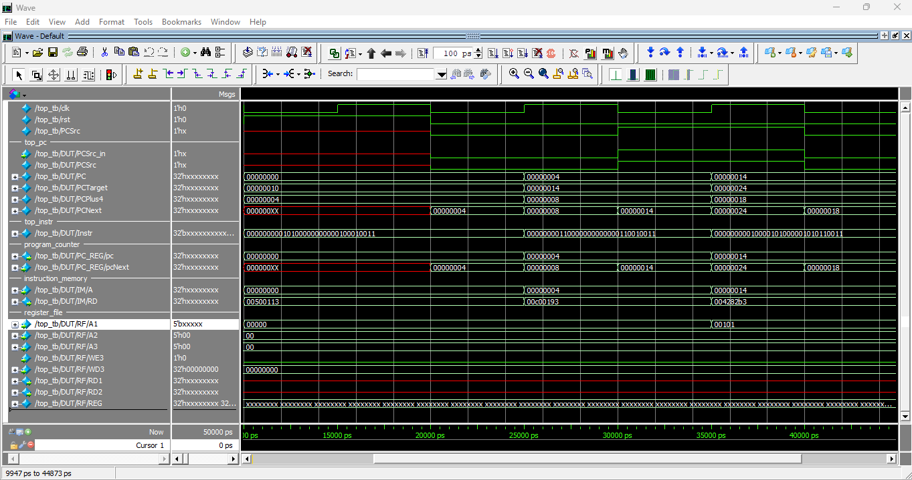
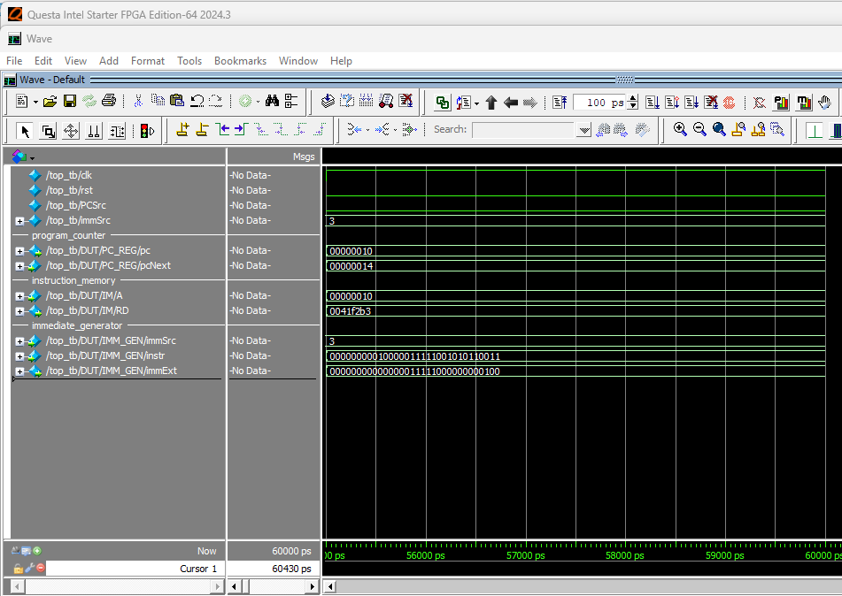
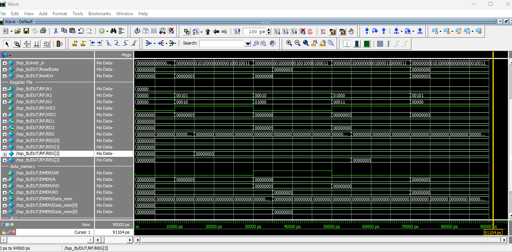

# RISC-V Single-Cycle Processor Implementation Details

## Overview

This document provides a comprehensive overview of the implementation and verification process for our single-cycle RISC-V processor. The processor supports the RV32I instruction set and has been thoroughly tested through step-by-step verification.

## Implementation Approach

The processor was implemented and verified in five main stages, each building upon the previous one to ensure correctness at every level of the datapath.

## Stage 1: Instruction Fetch

### Description
The first stage implements the basic instruction fetch mechanism, where the processor reads instructions from memory based on the Program Counter (PC).

### Key Components
- **Program Counter (PC):** Maintains the current instruction address
- **Instruction Memory:** Read-only memory containing the program instructions
- **PC Update Logic:** Sequential addressing (PC+4) or branch/jump targets

### Implementation Details
- PC initializes to 0x00 on reset
- Instructions are fetched from word-aligned addresses
- PC is updated based on `PCSrc` control signal:
  - `PCSrc = 0`: Sequential execution (PC = PC + 4)
  - `PCSrc = 1`: Branch/jump target (PC = PC + immExt)

### Verification
The instruction fetch was verified by monitoring:
- Correct PC initialization and increment
- Proper instruction output from memory
- PC update logic for sequential execution

### Simulation Waveform

The waveform below shows the behavior of the PC and instruction fetch signals during simulation.

---

## Stage 2: Register File Operations

### Description
This stage implements register file operations, focusing on reading source operands from the 32-register file.

### Key Components
- **Register File:** 32 × 32-bit registers with dual read ports and one write port
- **Address Decoding:** Extracting `rs1`, `rs2`, and `rd` fields from instructions

### Implementation Details
- Register x0 is hardwired to zero
- Simultaneous read from two source registers (`rs1`, `rs2`)
- Write operations occur on clock edge when `RegWrite = 1`
- Register addresses extracted from instruction bits:
  - `rs1`: bits [19:15]
  - `rs2`: bits [24:20]  
  - `rd`: bits [11:7]

### Verification
Verified by testing:
- Correct register address extraction
- Proper data output from register file
- Register x0 always reads as zero

### Simulation Waveform

The waveform below shows the values being read from `rs1`, as well as how the address `A1` is derived from the instruction bits.

---

## Stage 3: Immediate Generation

### Description
Implements the immediate generator that extracts and sign-extends immediate values for different instruction formats.

### Key Components
- **Immediate Generator:** Handles I, S, B, and J-type immediate formats
- **Sign Extension:** Properly extends immediates to 32 bits

### Implementation Details
The immediate generator operates based on the `ImmSrc` control signal:

| ImmSrc | Type  | Immediate Bits Extraction                                                                                                                                                                                        | Description                       | Usage                                 |
|--------|-------|------------------------------------------------------------------------------------------------------------------------------------------------------------------------------------------------------------------|-----------------------------------|-------------------------------------- |
| 00     | I-type| `immExt = {{20{instr[31]}}, instr[31:20]}`    (20 bits sign-extend, 12 bits instr[31:20])                                                                                                                     | Sign-extend bit 31 to 32 bits     | `addi`, `lw`, arithmetic immediates   |
| 01     | S-type| `immExt = {{20{instr[31]}}, instr[31:25], instr[11:7]}`   (20 bits sign-extend, 7 bits instr[31:25], 5 bits instr[11:7])                                                                                      | Sign-extend bit 31 to 32 bits     | `sw` (store operations)               |
| 10     | B-type| `immExt = {{19{instr[31]}}, instr[31], instr[7], instr[30:25], instr[11:8], 1'b0}`   (19 bits sign-extend, 1 bit instr[31], 1 bit instr[7], 6 bits instr[30:25], 4 bits instr[11:8], 1 bit zero)              | Sign-extend bit 31, LSB forced 0  | `beq` (branch operations)             |
| 11     | J-type| `immExt = {{12{instr[31]}}, instr[19:12], instr[20], instr[30:21], 1'b0}`   (12 bits sign-extend, 8 bits instr[19:12], 1 bit instr[20], 10 bits instr[30:21], 1 bit zero) | Sign-extend bit 31, LSB forced 0  | `jal` (jump operations)           |                                       |

### Instruction Type Examples

**I-type**  
Instruction: `00000000110000000000000110010011`  
`ImmSrc = 00`  
Immediate bits: `instr[31:20] = 000000001100`  
Extended immediate: `immExt = {{20{instr[31]}}, instr[31:20]}`  
Result: `00000000000000000000000000001100`

---

**S-type**  
Instruction: `11111111011100011000001110010011`  
`ImmSrc = 01`  
Immediate bits: `{instr[31:25], instr[11:7]} = 111111100111`  
Extended immediate: `immExt = {{20{instr[31]}}, instr[31:25], instr[11:7]}`  
Result: `11111111111111111111111111100111`

---

**B-type**  
Instruction: `00000000001000111110001000110011`  
`ImmSrc = 10`  
Immediate bits: `{instr[31], instr[7], instr[30:25], instr[11:8], 1'b0} = 0 0 000000 0010 0`  
Extended immediate: `immExt = {{19{instr[31]}}, instr[31], instr[7], instr[30:25], instr[11:8], 1'b0}`  
Result: `00000000000000000000000000000100`

---

**J-type**  
Instruction: `00000000010000011111001010110011`  
`ImmSrc = 11`  
Immediate bits: `{instr[31], instr[19:12], instr[20], instr[30:21], 1'b0}`  
Extended immediate: `immExt = {{11{instr[31]}}, instr[31], instr[19:12], instr[20], instr[30:21], 1'b0}`  
Result: `00000000000000011111000000000100`

### Verification
Each format was tested with specific instruction examples to verify:
- Correct bit extraction and concatenation
- Proper sign extension
- Expected 32-bit immediate output

---

## Stage 4: ALU Operations

### Description
This stage implements the core arithmetic and logic operations through the ALU and its decoder.

### Key Components
- **ALU Decoder:** Translates instruction fields to ALU control signals
- **ALU:** Performs arithmetic and logical operations
- **Control Logic:** Generates appropriate control signals

### ALU Decoder Implementation
The ALU decoder uses multiple inputs to determine the operation:
- `ALUOp[1:0]`: Operation category from main decoder
- `funct3[2:0]`: Instruction function bits
- `funct7[5]`: Instruction function bit 7
- `opcode[5]`: Instruction type bit

### ALU Control Signal Generation:

| ALUOp | Instruction Type | funct3 | funct7[5] | opcode[5] | ALUControl | Operation |
|-------|------------------|--------|-----------|-----------|------------|-----------|
| 00    | Load/Store       | xx     | x         | x         | 000        | ADD       |
| 01    | Branch           | xx     | x         | x         | 001        | SUB       |
| 10    | R-type/I-type    | 000    | 0         | 1 or 0    | 000        | ADD       |
| 10    | R-type           | 000    | 1         | 1         | 001        | SUB       |
| 10    | R-type/I-type    | 111    | x         | x         | 010        | AND       |
| 10    | R-type/I-type    | 110    | x         | x         | 011        | OR        |
| 10    | R-type/I-type    | 010    | x         | x         | 101        | SLT       |

### ALU Implementation
The ALU performs operations based on `ALUControl[2:0]`:

| ALUControl | Operation | Description           |
|------------|-----------|-----------------------|
| 000        | ADD       | SrcA + SrcB           |
| 001        | SUB       | SrcA - SrcB           |
| 010        | AND       | SrcA & SrcB           |
| 011        | OR        | SrcA \| SrcB          |
| 101        | SLT       | (SrcA < SrcB) ? 1 : 0|
| others     | -         | Output = 0            |

### Verification
Both ALU decoder and ALU were tested extensively including edge cases and signed comparisons.

#### Simulation Waveforms

ALU control generation and ALU operations are confirmed by these waveforms:

  
  
  

---

## Stage 5: Memory Operations and Write-Back

### Description
The final stage implements memory access operations and the write-back mechanism to complete the datapath.

### Key Components
- **Data Memory:** 1024-word synchronous memory for load/store operations
- **Write-Back Multiplexer:** Selects data source for register write-back
- **Memory Control:** Handles read/write operations

### Memory Access Implementation
- **Load Operations (`lw`):**
  - Address calculated: `rs1 + immediate`
  - Data read combinationally from memory
  - Written to destination register when `RegWrite = 1`
- **Store Operations (`sw`):**
  - Address calculated: `rs1 + immediate`  
  - Data from `rs2` written to memory when `MemWrite = 1`
  - Synchronous write on clock edge

### Write-Back Selection
The `ResultSrc[1:0]` control signal determines write-back source:

| ResultSrc | Source     | Description                       |
|-----------|------------|---------------------------------|
| 00        | ALU Result | Arithmetic/logic operation result|
| 01        | Memory     | Data loaded from memory (`lw`)   |
| 10        | PC+4       | Return address for `jal`         |

### Process Overview

1. ALU computes target memory address using `rs1` + immediate offset.
2. For `lw`: Data memory output is multiplexed into the register file write data.
3. For `sw`: Data from `rs2` is written into memory.
4. Destination register is updated if `RegWrite` is asserted and `rd != 0`.

### Simulation Waveform

The waveform below confirms correct behavior for memory operations and write-back.

---

## Final Execution and State Waveform

### Simulation Waveform

The following waveform shows the final execution loop and register/memory state:

---

## Control Signal Summary

For a detailed view of control signals per instruction, see our [Instruction Execution Table](instructions_table.md), which complements this documentation with:

- Instruction opcodes and assembly
- Control signals for each step (`reg_write`, `alu_src`, `result_src`, `imm_src`, `alu_control`, etc.)
- Registers read and written
- Memory operations
- Program flow including branch/jump decisions

---

## Program Execution Overview

The test program demonstrates all major processor capabilities including arithmetic, logic, control flow, and memory operations.

### Instruction Categories Tested:
- Immediate operations (`addi`)
- Arithmetic/logic operations (`add`, `sub`, `and`, `or`, `slt`)
- Control flow (`beq`, `jal`)
- Memory access (`lw`, `sw`)

### Final State Summary:
- Active registers: x2, x3, x4, x5, x7, x9 with meaningful values
- Memory locations written: 0x60, 0x64
- Program terminates in a controlled infinite loop

---

## Implementation Verification

Verification was performed via:
- Modular stage testing
- Full datapath integration
- Instruction coverage
- Edge case scenarios (branch conditions, memory boundaries, register zero)
- Control signal correctness

---

## Conclusion

The single-cycle RISC-V processor fully supports the RV32I instruction set, verified through a stepwise implementation and testing methodology. The instruction execution table provides a detailed reference for understanding processor behavior and supports further verification or education.

---
